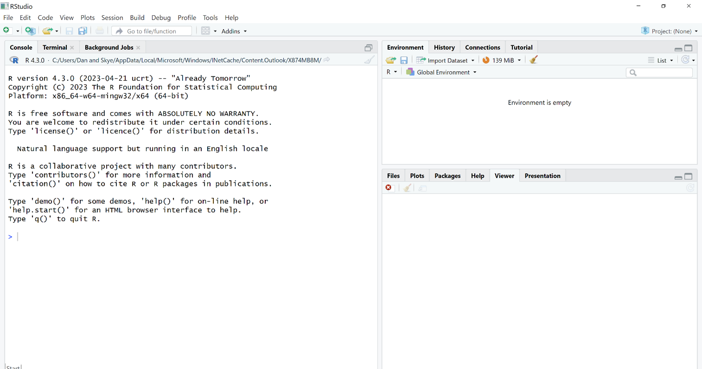
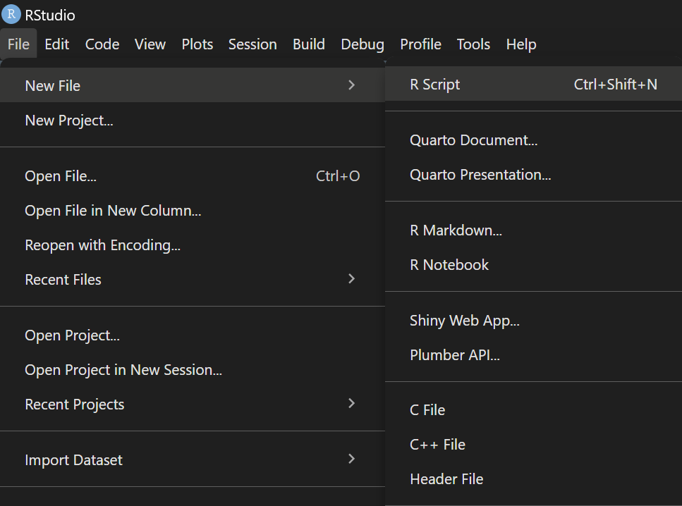
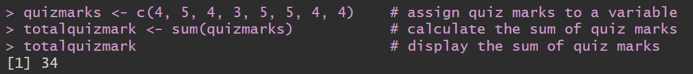
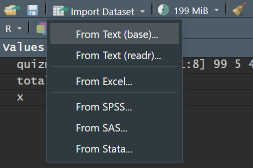

```{r setup, include=FALSE}
knitr::opts_chunk$set()
```

## Why R

- Quick and out of the box stats tools.
- Organised and Pretty Output.
- Career competitiveness.
- transferable skills.

## How to Learn R

- High variability in programming skills across the population.
  * In tutorial, we assume NO programming experience.
  * So, you are encourage to keep your own pace, if you are already familiar with programming.
- Practice, practice, practice.
- Why rather than what - build understanding and intuition rather than memorising.

## R Interface

```{r, echo=FALSE, out.width="100%"}

```

## R as Calculator (Part 2)

- Operators: `+`, `-`, `*`, `/`, `^`

```{r}
1 + 1
```

```{r}
3^2
```

## Calculator with Variables

- Variable: Store values for later reference; So variable $\approx$ labeled value

```{r}
x <- 1
x
```

```{r, echo=FALSE, results='asis'}
DiagrammeR::grViz("
  digraph LR {
    rankdir=RL;
    A [shape=plaintext,label='x'];
    B [label='1'];
    A -> B;
  }
")
```

```{r}
x + 1
```

## Calculator with Variables

```{r}
x + 1
```

```{r, echo=FALSE, results='asis'}
DiagrammeR::grViz("
  digraph LR {
    rankdir=RL;
    A [shape=plaintext,label='x + 1'];
    B [label='1 + 1'];
    A -> B;
  }
")
```


## Rules for Naming Variables

Generally, names looks like

```r
a_variable_name
```

So,

- it start with a small letter and use underscore to separate words.
- it should reflect the content/meaning of the value it stores. So `x` is not a good name.

In your handout, you have more specific rules.

## Multiple Values to One Variable

- Sometimes, we want to store many values that have the same nature.
- That is a list.

```{r}
quizmarks <- c(4, 5, 4, 3, 5, 5, 4, 4)
quizmarks
```

## Multiple Values to One Variable

- We want a way to access specific values in the list.

```{r}
quizmarks[1]
```

- referencing the first value to do some calculation

```{r}
quizmarks[1] + 1
```

## Multiple Values to One Variable

- We can also change the specific value in the list.

```{r}
quizmarks[1] <- 99
quizmarks
```

```{r, echo=FALSE, include=FALSE}
quizmarks[1] <- 4
```

## Bulk Operations

- Why we even bother to store multiple values in one variable?
- We can do bulk operations.

```{r}
sum(quizmarks)
```

```{r}
mean(quizmarks)
```
## Using Script Files

- I do not want to type the same commands again when I close and reopen R.
- Then we need save commands in a script file.

```{r, echo=FALSE, out.width="100%"}

```

## Using Script Files

```r
# I am a script file
# Let's do some multiple-line operations

quizmarks <- c(4, 5, 4, 3, 5, 5, 4, 4)    # assign quiz marks to a variable
totalquizmark <- sum(quizmarks)           # calculate the sum of quiz marks
totalquizmark                             # display the sum of quiz marks
```

## Using Script Files

- After you hit Run button, you will see your code is pasted to the console and run.

```{r, echo=FALSE, out.width="100%"}

```

## Import Data From Files

- More than Calculator, we want it help us to analyse data. So we want import data from files.
- Check the `heading` box.

```{r, echo=FALSE, out.width="70%"}

```

```{r, include=FALSE}
psyc2012w3 <- read.csv("C:/Users/spike/OneDrive/phd/250226 - psyc2012/w3/psyc2012w3.csv")
```

## View Data

- click Data variable in Environment tab
- `str()`

## Start Stats

```{r}
table(psyc2012w3$swl1)
```

```{r, out.width="50%"}
hist(psyc2012w3$swl1)
```