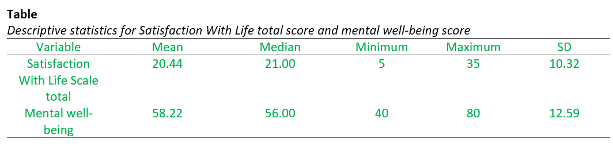

```{r}
library(tidyverse)
```


## Q6

```{r}
quizmarks <- c(4, 5, 4, 3, 5, 5, 3, 3)
#Q1 min mark
min(quizmarks)
max(quizmarks)
```

```{r}
# Q2
mean(quizmarks)
```

```{r}
# Q3
median(quizmarks)
```

```{r}
# Q4
var(quizmarks)
```

```{r}
sum((quizmarks - mean(quizmarks))^2) / (length(quizmarks) - 1)
```

```{r}
# Q5
sd(quizmarks)
```

## Part 2

```{r}
psyc2012w4 <- read.csv("./psyc2012w4.csv")


psyc2012w4 <- read.csv("C:/Users/spike/OneDrive/phd/250226 - psyc2012/w4/psyc2012w4.csv")
```

### Q7

```{r}
hist(psyc2012w4$swls_total)
```

```{r}
hist(psyc2012w4$mwb)
```

### Q8

```{r}
table(psyc2012w4$swls_total)
sum(c(3, 1, 2, 1, 1, 1, 3, 1, 1, 2, 2, 2, 2, 1, 1, 1))
```

```{r}
table(psyc2012w4$mwb)
sum(1, 1, 3, 1, 2, 1, 2, 1, 3, 1, 1, 1, 1, 2, 1, 1)
```

```{r}
psyc2012w4$mwb
```

```{r}
table(psyc2012w4$swls_total, useNA="ifany")
table(psyc2012w4$mwb, useNA="ifany")
```

### Q9

```{r}
mean(psyc2012w4$swls_total)
median(psyc2012w4$swls_total)
min(psyc2012w4$swls_total)
max(psyc2012w4$swls_total)
sd(psyc2012w4$swls_total)
mean(psyc2012w4$mwb)
median(psyc2012w4$mwb)
min(psyc2012w4$mwb)
max(psyc2012w4$mwb, na.rm = TRUE)
sd(psyc2012w4$mwb, na.rm = TRUE)
```

### Q10



## Part 3

### Q11

```{r}
# norm distribution may looks like
hist(rnorm(100))
```

### Q12

```{r}
Mmwb <- mean( psyc2012w4$mwb, na.rm = TRUE)
Sdmwb <- sd( psyc2012w4$mwb, na.rm = TRUE)
psyc2012w4$Zmwb <- (psyc2012w4$mwb - Mmwb) / Sdmwb
```

```{r}
psyc2012w4$Scale_mwb <- scale(psyc2012w4$mwb)
```

```{r}
var(psyc2012w4$Scale_mwb, na.rm=T)
```

### Q13

```{r}
hist(psyc2012w4$Zmwb, breaks = 15)
```

```{r}
hist(psyc2012w4$mwb, breaks = 15)
```

### Q15

```{r, echo=FALSE}
pnorm(0)
visualize_pnorm(0)
```

### Q16

```{r, echo=FALSE}
pnorm(-1)
visualize_pnorm(-1)
```

### Q17

```{r, echo=FALSE}
pnorm(2, lower.tail = FALSE)
1 - pnorm(2)
visualize_pnorm(2)
```

### Q18

```{r, echo=FALSE}
qnorm(.6)
visualize_qnorm(.6)
```