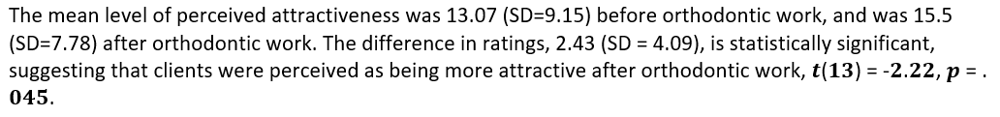

```{r}
library(tidyverse)
```


## Q1

$H_0$: the mental well-being of university students is no different to the general adult population
$H_A$: the mental well-being of university students is different to the general adult population

$$
H_0: \mu = 75.7\\
H_A: \mu \ne 75.7
$$

## Q2

```{r}
# prepare data
psyc2012w7p1 <- read.csv("./psyc2012w7p1.csv")
```

```{r}
table(psyc2012w7p1$SF_36, useNA="ifany")
```

## Q3

```{r}
hist(psyc2012w7p1$SF_36)
```

## Q4

```{r}
mean(psyc2012w7p1$SF_36, na.rm=TRUE)
```

```{r}
sd(psyc2012w7p1$SF_36, na.rm=TRUE) 
```

## Q5

```{r}
t.test(psyc2012w7p1$SF_36, mu=75.7)
```

## Q6


* Estimate of the population standard deviation

```{r}

```

## Q7


## Q8

```{r}
t.test(psyc2012w7p1$SF_36, mu=75.7)
```
95% CI: (63.69 < µ < 65.50)

## Q9

75.7 > 65.50

## Q10

```{r}
t.test(psyc2012w7p1$SF_36, mu=75.7, conf.level=0.9)
```

## Q12

```{r}
# prepare data
psyc2012w7p3 <- read.csv("./psyc2012w7p3.csv")
```

```{r}
# create a new column to store the difference between before and after
psyc2012w7p3$diff <- psyc2012w7p3$before - psyc2012w7p3$after
```

## Q14

```{r}
mean(psyc2012w7p3$before, na.rm=TRUE)
mean(psyc2012w7p3$after, na.rm=TRUE)
sd(psyc2012w7p3$before, na.rm=TRUE)
sd(psyc2012w7p3$after, na.rm=TRUE)
```

## Q15

```{r}
mean(psyc2012w7p3$diff, na.rm=TRUE)
sd(psyc2012w7p3$diff, na.rm=TRUE)
```

## Q16

```{r}
t.test(psyc2012w7p3$diff, mu=0)
```


## Q17

```{r}
t.test(psyc2012w7p3$before, psyc2012w7p3$after, paired=TRUE)
```

## Q18



## Q19

$$
 H_0: \mu_{\text{international}} - \mu_{\text{domestic}} = 0 \\
H_A: \mu_{\text{international}} - \mu_{\text{domestic}} \ne 0
$$

## Q20

### (a)

```{r}
aggregate(psyc2012w7p1$SF_36 ~ psyc2012w7p1$International_Domestic, FUN=mean)
```

### (b)

```{r}
mean1 <- aggregate(psyc2012w7p1$SF_36 ~ psyc2012w7p1$International_Domestic, FUN=mean)[1,2]
mean2 <- aggregate(psyc2012w7p1$SF_36 ~ psyc2012w7p1$International_Domestic, FUN=mean)[2,2]
```

### (c)

```{r}
sd1 <- aggregate(psyc2012w7p1$SF_36 ~ psyc2012w7p1$International_Domestic, FUN=sd)[1,2]
sd2 <- aggregate(psyc2012w7p1$SF_36 ~ psyc2012w7p1$International_Domestic, FUN=sd)[2,2]
```

### (d)

```{r}
n1 <- aggregate(psyc2012w7p1$SF_36 ~ psyc2012w7p1$International_Domestic, FUN=length)[1,2]
n2 <- aggregate(psyc2012w7p1$SF_36 ~ psyc2012w7p1$International_Domestic, FUN=length)[2,2]
```

### (e)

```{r}
SS1 <- sd1^2*(n1-1)
SS2 <- sd2^2*(n2-1)
```


## Q21

```{r}
t.test(psyc2012w7p1$SF_36 ~ psyc2012w7p1$International_Domestic, var.equal=TRUE)
```


## Q22


## Q23

```{r}
pooledSS <- SS1 + SS2
pooledDF <- (n1 - 1) + (n2 - 1)
spooled <- sqrt(pooledSS/pooledDF)
(mean1 - mean2)/spooled
```

