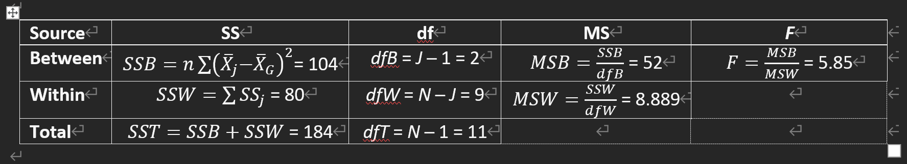

```{r}
library(tidyverse)
```


## PART 1

### Q1

```{r}
psyc2012w8p1 <- read.csv("./psyc2012w8p1.csv")
table(psyc2012w8p1$belong)
```
### Q2

```{r}
str(psyc2012w8p1$belong)
```

```{r}
table(psyc2012w8p1$belong)
```

```{r}
psyc2012w8p1$belong <- factor(psyc2012w8p1$belong, levels=c("A little", "Somewhat", "A lot"))
```

```{r}
str(psyc2012w8p1$belong)
```

```{r}
table(psyc2012w8p1$belong)
```

### Q3

```{r}
aggregate(psyc2012w8p1$SF_36_mh ~ psyc2012w8p1$belong, FUN=mean)

# psyc2012w8p1 %>%
#   group_by(belong) %>%
#   summarise(
#     m = mean(SF_36_mh)
#   )
```

```{r}
aggregate(psyc2012w8p1$SF_36_mh ~ psyc2012w8p1$belong, FUN=sd)
```

```{r}
aggregate(psyc2012w8p1$SF_36_mh ~ psyc2012w8p1$belong, FUN=length)
```

### Q4

```{r}
# define a plot function
aov_barplot <- function(f, data, ylim=c(0, ceiling(max(m+se)*1.5)), l = ifelse(length(all.vars(f))>2, T, F), xpd=F,...){
  m = xtabs(f, aggregate(f, data, mean))
  se = xtabs(f, aggregate(f, data, FUN=function(x) sd(x)/sqrt(length(x))))
  bp = barplot(m, beside=T, ylim=ylim, ylab=paste("mean", all.vars(f)[1]), xlab=all.vars(f)[3], legend=l, ...); box()
  arrows(bp, m-se, bp, m+se, angle=90, length=0.2, code=3)
}
```

```{r}
aov_barplot(SF_36_mh ~ belong, psyc2012w8p1)
```

### Q5

```{r}
result <- aov(SF_36_mh ~ belong, data=psyc2012w8p1)
summary(result)
```

$$
\begin{align*}
H_0 &: \mu_{\text{little}} = \mu_{\text{somewhat}} = \mu_{\text{lot}} \\
H_A &: \text{not } H_0
\end{align*}
$$

mean mental wellbeing scores differed significantly as a function of student sense of belonging, F(2,350) = 32.24, p < .001.

### Q6

Problem: diff but no direction.

### Q7

Type I error inflation

(1 - 0.05) ^2 

### Q8

$$
\begin{align*}
\eta^2 =& \frac{SS_B}{SS_T} \\
=& \frac{3765}{3765 + 20435} \\
=& 0.1555785
\end{align*}
$$

Eta-squared rules of thumb (Cohen): .01 = small, .06 = medium, .14 = large.

### Q9

```{r}
TukeyHSD(aov(SF_36_mh ~ belong, data=psyc2012w8p1))
```

No sig difference between "Somewhat-A little". But "A lot" group is significantly different from other two groups.

### Q10

Potential related. But causality? Think about confounding.

## Part 2

### Q11

```{r}
group1 = c(7,10,14,13)
group2 = c(5,8,1,2)
group3 = c(6,8,12,10)
```

### Q12

```{r}
mean(group1)
mean(group2)
mean(group3)
```

Error: sampling? by chance? 
Treatment?
Experimenter?

### Q13

H₀: μ₁ = μ₂ = μ₃ → The average number of correctly recognized words is the same across all three processing conditions (meaning, form, rhyme).

Hₐ: Not H₀ → There is a difference in recognition across conditions. At least one group differs from the others, but we don't know which or how many.

### Q14

```{r}
sd(group1)
sd(group2)
sd(group3)
```

```{r}
var(group1)*(4-1)
var(group2)*(4-1)
var(group3)*(4-1)
```

### Q15



### Q15

```{r}
n = 4
groupMeans = c(11, 4, 9)
J = 3
SSj = c(30, 30, 20)
N = n*J

grandMean = mean(groupMeans)
devMeans = groupMeans - grandMean
sq_devMeans = devMeans^2
SSB = n * sum(sq_devMeans)

SSW = sum(SSj)
SST = SSB + SSW

dfB = J - 1
dfW = N - J
dfT = N - 1

MSB = SSB/dfB
MSW = SSW/dfW

F_value = MSB/MSW
F_value
```

### Q16

```{r}
pf(5.85, 2, 9, lower.tail=FALSE)
```

p < α, so reject H0.

Recognition memory differed significantly as a function of level of processing, 𝑭(𝟐, 𝟗)=𝟓.𝟖5, 𝒑<.𝟎𝟓.

### Q17

𝜼𝟐=𝑺𝑺𝑩 / 𝑺𝑺𝑻 = 𝟏𝟎𝟒 / 𝟏𝟖𝟒 = .𝟓𝟕
57% of the total variability in memory scores is accounted for by the differences between levels of processing

### Q18

No extctly 0. Errors always exists.

### Q19

If 𝑯𝒐 is true, MSB is an estimate of error, just as MSW is.

### Q20

If 𝑯𝒐 is not true, MSB is estimating the treatment effect AND errors.