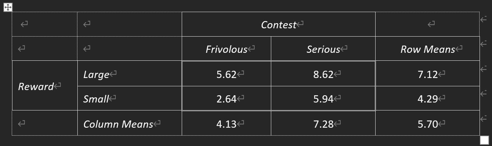
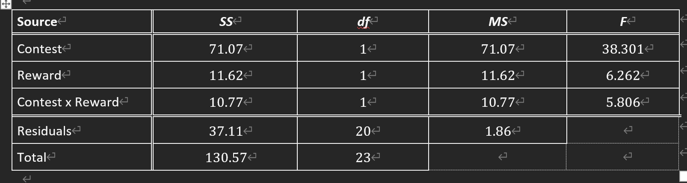
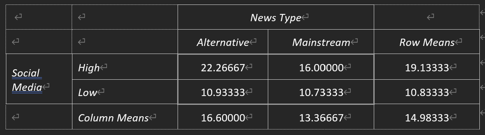

---
output:
  html_document:
    toc: true
    toc_float: true
    number_sections: true
    toc_depth: 5
title: "Descriptive Statistics"
author: "Spike"
---

```{r}
library(tidyverse)
```

## PART 1

### Q1

A between-subjects factorial design. 2 x 2 x 3 design. 

### Q2

Main effect of contest: serious vs. non-serious on motivation
Main effect of reward: large vs. small on motivation

Interaction: the effect of one variable depends on the level of the other variable

### Q3

```{r}
psyc2012w9p1 <- read.csv('psyc2012w9p1.csv')

aov_barplot <- function(f, data, ylim=c(0, ceiling(max(m+se)*1.5)), l = ifelse(length(all.vars(f))>2, T, F), xpd=F, ...){
  m = xtabs(f, aggregate(f, data, mean))
  se = xtabs(f, aggregate(f, data, FUN=function(x) sd(x)/sqrt(length(x))))
  bp = barplot(m, beside=T, ylim=ylim, ylab=paste("mean", all.vars(f)[1]), xlab=all.vars(f)[3], legend=l, ...); box()
  arrows(bp, m-se, bp, m+se, angle=90, length=0.2, code=3)
}

aov_barplot(motivation ~ reward + contest, psyc2012w9p1)
```

large reward -> higher motivation
serious contest -> higher motivation

But if we control the seriousness of the contest, the effect of reward is the same, so no interaction.

### Q4

```{r}
aggregate(motivation ~ reward, data=psyc2012w9p1, FUN=mean)
```

```{r}
aggregate(motivation ~ contest, data=psyc2012w9p1, FUN=mean)
```

```{r}
aggregate(motivation ~ reward + contest, data=psyc2012w9p1, FUN=mean)
```

```{r}
mean(psyc2012w9p1$motivation)
```



### Q5

Main effect of reward.

### Q6

Main effect of contest.

### Q7

Reward by contest interaction effect.

```{r}
# in frivolous group
5.616667 - 2.635000
# in serious group
8.616667 - 5.935000	
```

The influence of the reward is similar.

### Q8

```{r}
summary(aov(motivation ~ reward * contest, data=psyc2012w9p1))
```

Note: write p < .001 rather than p = 0, even if it is 1e-10.

Main effect of contest: Averaged over type of reward, motivation is significantly higher among athletes competing in a serious contest (M=7.28) than athletes competing in a professionally frivolous contest (M=4.13), F(1,20)=28.29, p<.001.
 
Main effect of reward: Averaged over type of contest, motivation is significantly higher among athletes who are offered a large reward (M=7.12) than athletes who are offered a small reward (M=4.29), F(1,20)=22.86, p<.001.

Interaction effect: (Interestingly,) this positive effect of a large reward on motivation does not differ significantly between athletes competing in a serious contest and athletes competing in a frivolous contest, F(1,20)=0.06, p=.80. 

### Q9

reward works in both contexts.

## PART 2

### Q10

```{r}
J = 2 # contest: serious, frivolous
K = 2 # reward: large, small

df_contest = J - 1
df_reward = K - 1

df_contest
df_reward
```

```{r}
df_interaction = (J - 1) * (K - 1)
df_interaction
```

```{r}
N = nrow(psyc2012w9p1)
df_residual = N - J * K
df_residual
```

```{r}
df_total = N - 1
df_total
```

```{r}
# validate
df_contest + df_reward + df_interaction + df_residual
```

```{r}
MS_contest = 71.07 / df_contest
MS_reward = 11.62 / df_reward
MS_interaction = 10.77 / df_interaction
MS_residual = 37.11 / df_residual

MS_contest
MS_reward
MS_interaction
MS_residual
```

```{r}
F_contest = MS_contest / MS_residual
F_reward = MS_reward / MS_residual
F_interaction = MS_interaction / MS_residual

F_contest
F_reward
F_interaction
```



### Q11

```{r}
qf(.05, 1, 20, lower.tail=FALSE)
```

### Q12

Main effect of contest: Averaged over type of reward, motivation is significantly higher among athletes competing in a serious contest (M=9.23) than athletes competing in a professionally frivolous contest (M=5.79), F(1,20)=38.30, p<.05. 
 
Main effect of reward: Averaged over type of contest, motivation is significantly higher among athletes who are offered a large reward (M=8.20) than athletes who are offered a small reward (M=6.81), F(1,20)=6.26, p<.05.  

Interaction effect: Differences in motivation between athletes who were offered a large and small reward was significantly more marked for those competing in a frivolous contest than those competing in a serious contest, F(1,20)=5.81, p<. 05.

### Q13

In serious games, reward does not matter, so maybe you can save your money.

### Q14

- more economical (in terms of sample size)
- can explore interaction effects
- can account for more of the variability in the dependent variable

## Part3

### Q15

```{r}
psyc2012w9p3 <- read.csv('psyc2012w9p3.csv')
```

```{r}
aov_barplot(Anxiety ~ SocialMedia + NewsType, psyc2012w9p3)
```

### Q16

```{r}
aggregate(Anxiety ~ SocialMedia, data=psyc2012w9p3, FUN=mean)
```

```{r}
aggregate(Anxiety ~ NewsType, data=psyc2012w9p3, FUN=mean)
```

```{r}
aggregate(Anxiety ~ SocialMedia + NewsType, data=psyc2012w9p3, FUN=mean)
```

```{r}
mean(psyc2012w9p3$Anxiety)
```




### Q17

```{r}
summary(aov(Anxiety ~ SocialMedia * NewsType, data=psyc2012w9p3))
```

Main effect of Social Media: Averaged over news type, anxiety is significantly higher among adolescents with high (M=19.13) than low social media use (M=10.83), F(1,56)=82.34, p<.001.
 
Main effect of News Type: Averaged over social media use, anxiety is significantly higher among adolescents watching news from an alternative (M=16.60) than mainstream source (M=13.37), F(1,56)=12.49, p<.001.

Interaction effect: This negative effect of high social media use on anxiety is significantly greater in adolescents watching news from an alternative than mainstream source, F(1,56)=11.00, p=.002. 

### Q18
 
media use was clearly not randomly allocated.So a confounder.